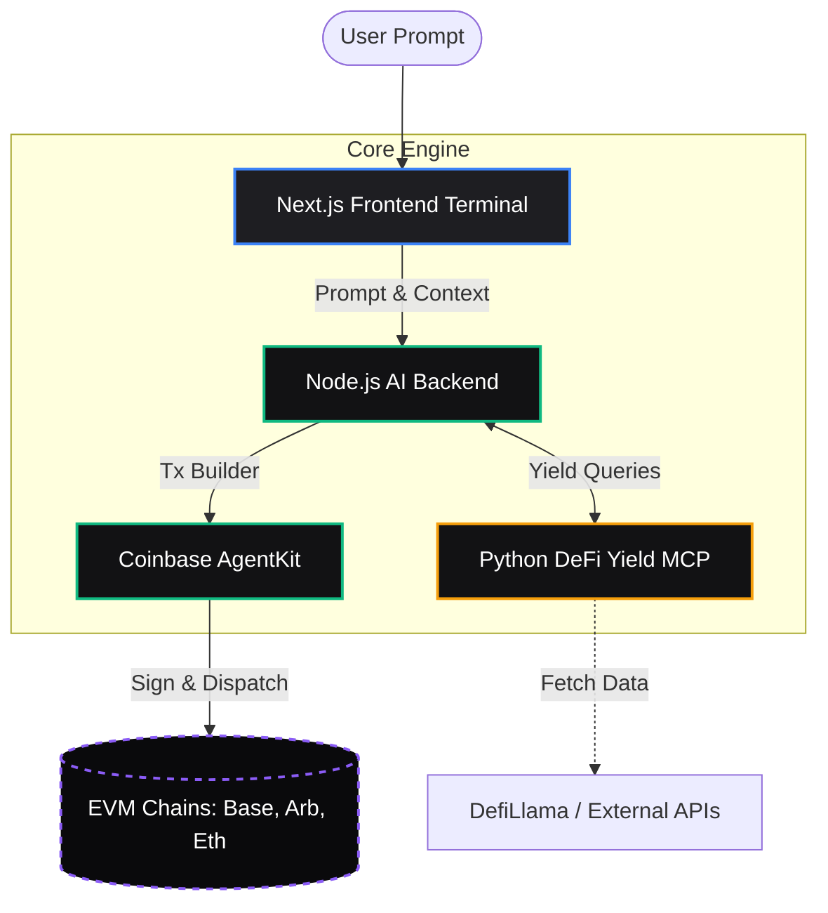

# UNIT — Autonomous DeFi Execution Engine


UNIT is a next-generation, AI-driven DeFi execution engine. Instead of manually bridging, swapping, and staking across fragmented networks, users simply provide a natural language prompt (e.g., *"Find the best safe yield for my 100 USDC on Arbitrum"*). 

UNIT's autonomous agents will research the yield surfaces, formulate an optimal routing and execution plan, and dispatch the transactions completely autonomously using secure intent-based architecture.

## 🚀 Key Features

- **Prompt-to-Execution:** Convert natural language into complex, multi-step on-chain transactions.
- **Cross-Chain by Default:** Native integration with bridging and routing protocols (e.g., LI.FI) to execute actions across any EVM chain.
- **Real-Time Yield Research:** Utilizes a custom Model Context Protocol (MCP) to scrape live APY and TVL data across DeFi protocols.
- **Premium Glassmorphic UI:** A highly polished, responsive "dark-glass" dashboard built with Framer Motion and TailwindCSS v4.
- **Risk-Aware Routing:** The AI evaluates slippage, liquidity, and smart contract risk before executing a plan.

---

## 🏗️ System Architecture

UNIT is composed of three primary microservices:

1. **Frontend (Next.js)**: The premium user interface and terminal.
2. **Backend (Node.js/AgentKit)**: The AI reasoning and transaction building engine.
3. **DeFi Yield MCP (Python)**: The data-scraping context provider for real-time yields.



---

## 📁 Repository Structure

### 1. `/frontend` (Next.js 15)
The user-facing application built with the App Router.
- **`app/`**: Contains the landing page (`/`) and the primary dashboard (`/app`).
- **`components/`**: Modular, highly reusable UI components (Charts, Execution Panels, Strategy Cards).
- **Styling**: Enforces a strict, premium dark-mode aesthetic utilizing raw CSS variables and Tailwind utilities (`glass`, `shimmer`).

### 2. `/backend` (Node.js & TypeScript)
The brain of UNIT. It exposes REST/WebSocket endpoints that the frontend consumes.
- **`server.ts` & `index.ts`**: The core API gateways.
- **`agent.ts`**: Integrates LLMs with Coinbase AgentKit to parse user intent into executable steps.
- **`txBuilder.ts`**: Safely constructs the calldata, handles approvals, and simulates transactions before execution.

### 3. `/defi-yield-mcp` (Python)
A Model Context Protocol (MCP) server.
- Serves as an isolated, scalable data scraper.
- Provides the Node.js backend with up-to-the-minute APY, TVL, and pool health metrics so the AI never hallucinates yield data.

---

## 💻 Local Development & Setup

### Prerequisites
- Node.js (v18+)
- Python (v3.10+)
- `pnpm` or `npm`

### 1. Frontend Setup
```bash
cd frontend
npm install
npm run dev
# The frontend will be running on http://localhost:3000
```

### 2. Backend Setup
You will need an OpenAI API Key and Coinbase AgentKit credentials.
```bash
cd backend
npm install
# Copy the example env file and add your keys
cp .env.example .env
npm run dev
```

### 3. Yield MCP Setup
```bash
cd defi-yield-mcp
python -m venv venv
source venv/bin/activate
pip install -r requirements.txt
# Run the MCP server
python -m src.server
```

---

## 🔒 Security Architecture

- **Non-Custodial**: The AI constructs the transaction payload, but it is ultimately signed and broadcasted securely.
- **Simulation Checks**: Before any transaction is proposed to the user, `txBuilder.ts` simulates the execution to catch potential reverts or sandwich attacks.
- **Rate Limiting**: The backend aggressively limits prompt submissions to prevent API abuse.

## 🤝 Contributing

1. Fork the repository
2. Create your feature branch (`git checkout -b feature/AmazingFeature`)
3. Commit your changes (`git commit -m 'Add some AmazingFeature'`)
4. Push to the branch (`git push origin feature/AmazingFeature`)
5. Open a Pull Request
