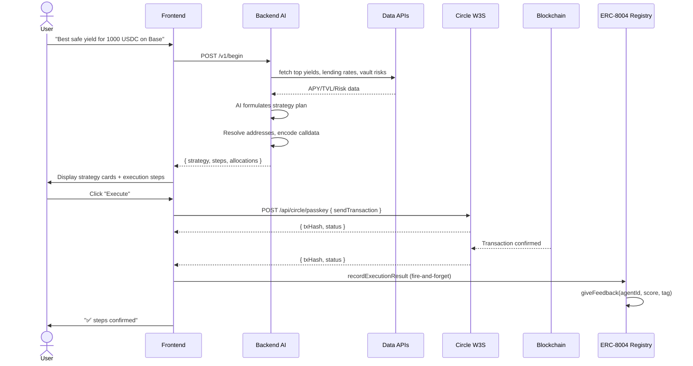

# UNIT — Autonomous DeFi Execution Engine

<p align="center">
  
  
  
  
  
</p>

---

**Stop chasing yields across a dozen tabs. UNIT reads your intent in plain English, researches the best opportunities across all of DeFi in real time, and executes the entire strategy on-chain — from approval to swap to deposit — in one shot. Every execution is permanently recorded as verifiable on-chain reputation via ERC-8004.**

---

## The Problem

DeFi is fragmented across dozens of chains, hundreds of protocols, and thousands of pools. To execute a single strategy like *"put 1000 USDC into the safest USDC vault on Arbitrum"*, a user must:

1. Bridge funds to Arbitrum (if not already there)
2. Research vaults across Morpho, Yearn, Aave, Compound, Euler, Spark
3. Compare APYs, TVLs, and risk profiles
4. Approve the vault contract to spend USDC
5. Deposit into the vault
6. Track the transaction on-chain

This takes 30+ minutes of manual work across multiple dashboards, explorer tabs, and wallet prompts — assuming the user even knows where to look.

Even when execution succeeds, there is **no on-chain record of agent performance**. Autonomous DeFi agents operate as black boxes — users have no way to verify an agent's historical success rate, review its execution history, or compare agents by trustworthiness. This lack of transparency makes it impossible to build reputation-driven markets for autonomous strategies.

## The Solution

**UNIT collapses this entire workflow into a single natural language prompt.**

Type what you want. UNIT's AI agent researches live yield data via 17 local tools across 7 modules, formulates a multi-step execution plan, and presents it for your review. One click executes the entire pipeline — approvals, swaps, and deposits — through smart contract wallets with deterministic gas and no seed phrase management.

**Every execution is immutably recorded on-chain via [ERC-8004](https://eips.ethereum.org/EIPS/eip-8004) Autonomous Agent Reputation.** Each step (approve, swap, deposit) is scored 100 for success or 0 for failure by a validator wallet and written to the ReputationRegistry smart contract. Anyone can query an agent's on-chain track record — total executions, average score, per-step breakdown — creating a transparent, verifiable reputation layer for autonomous agents.

---

## Architecture

```
┌──────────────────────────────────────────────────────────────────┐
│                        USER INTERFACE                            │
│                    Next.js 15 + Tailwind v4                       │
│          Glassmorphic UI · Framer Motion · Recharts              │
└──────────────────────────┬───────────────────────────────────────┘
                           │ POST /v1/begin
                           │ { userPrompt, userWallet, chainId }
                           ▼
┌──────────────────────────────────────────────────────────────────┐
│                      AI ORCHESTRATION LAYER                       │
│                    Node.js Express + OpenAI API                    │
│                                                                   │
│  ┌─────────────┐   ┌──────────────┐   ┌───────────────────────┐  │
│  │  agent.ts   │──▶│    index.ts  │──▶│     txBuilder.ts      │  │
│  │ (System     │   │ (MCPClient   │   │ (viem calldata encoder│  │
│  │  Prompt)    │   │  + 17 local  │   │  · ERC20 · ERC4626    │  │
│  └─────────────┘   │  tools)      │   │  · Lending Pool       │  │
│                    └──────┬───────┘   │  · cToken · LiFi)     │  │
│                           │           └───────────────────────┘  │
└───────────────────────────┼───────────────────────────────────────┘
                            │
                            ▼
┌──────────────────────────────────────────────────────────────────┐
│                      EXECUTION LAYER                               │
│                    Circle W3S Smart Contract Wallets               │
│                                                                   │
│  ┌──────────────────────┐      ┌──────────────────────────────┐  │
│  │  /api/circle/passkey │      │  /api/circle/social          │  │
│  │  Developer-controlled│      │  User-controlled             │  │
│  │  (entitySecret auth) │      │  (challenge-based auth)      │  │
│  └──────────┬───────────┘      └──────────────┬───────────────┘  │
│             │                                  │                  │
│             └──────────┬───────────────────────┘                  │
│                        ▼                                         │
│    ┌────────────────────────────────────────────┐                ││
│    │     Circle W3S contractExecution API        │                │
│    │     · feeLevel · callData · entitySecret    │                │
│    └──────────────────┬─────────────────────────┘                │
│                       │                                          │
│                       ▼                                          │
│    ┌────────────────────────────────────────────┐               │
│    │     ERC-8004 REPUTATION LAYER               │               │
│    │     · IdentityRegistry (agent NFTs)         │               │
│    │     · ReputationRegistry (on-chain scores)  │               │
│    │     · ValidationRegistry (verification)      │               │
│    └─────────────────────┬───────────────────────┘               │
└──────────────────────────────────────────────────────────────────┘
                          │
                          ▼
┌──────────────────────────────────────────────────────────────────┐
│                      BLOCKCHAIN LAYER                             │
│                                                                   │
│     ┌──────────┐   ┌──────────┐   ┌──────────┐   ┌──────────┐  │
│     │ Ethereum │   │ Arbitrum │   │   Base   │   │    Arc   │  │
│     │   (1)    │   │ (42161)  │   │  (8453)  │   │ (5042002)│  │
│     └──────────┘   └──────────┘   └──────────┘   └──────────┘  │
│     ┌──────────┐   ┌──────────┐   ┌──────────┐                  │
│     │ Optimism │   │ Polygon  │   │ Avalanche│                  │
│     │  (10)    │   │  (137)   │   │ (43114)  │                  │
│     └──────────┘   └──────────┘   └──────────┘                  │
└──────────────────────────────────────────────────────────────────┘
```

### Execution Flow (End-to-End)



---

## Features

### 🤖 AI-Powered Strategy Generation
- **Natural language understanding** — describe goals in plain English, not Solidity
- **Multi-protocol routing** — the AI evaluates Morpho, Aave, Yearn, Compound, Euler, Spark and selects the optimal path
- **Live data, not hallucinations** — 17 local tools (DefiLlama, CoinGecko, LI.FI, Philidor, Hive, CCXT) feed real-time APY, TVL, prices, and risk scores into every decision
- **Risk-aware allocation** — splits capital across vault, lending, and speculation buckets based on your risk profile

### 🔗 Cross-Chain Infrastructure (LI.FI)
- **200+ DEXs across 20+ chains** aggregated through LI.FI
- **Automatic quotes** — the backend calls LI.FI to get the best swap route, no manual routing
- **Token-agnostic** — deposit ETH, get USDC; swap USDC, get EURC; the engine handles it

### 💼 Smart Contract Wallets (Circle W3S)
- **Two wallet types**: Passkey (developer-controlled, `/api/circle/passkey`) and Social (user-controlled, `/api/circle/social`)
- **No seed phrases** — passkey via WebAuthn biometrics, or Google OAuth social login
- **Passkey**: WebAuthn credential on device → derives keccak256 Ethereum address → creates developer-controlled Circle wallet (no user challenge prompts for execution)
- **Social**: Google OAuth → Circle user-controlled wallet with challenge-based execution (PIN/biometric prompt per tx)
- **Passkey recovery**: `credentialId → walletId` mapping stored server-side survives localStorage clears
- **Gas abstraction** — `feeLevel: "MEDIUM"` handles fee estimation automatically
- **Batch atomicity** — multi-step pipelines execute as a single `executeBatch` user operation

### 📊 Premium Real-Time UI
- **Glassmorphic dark theme** — premium aesthetic with frosted glass effects, subtle animations, and responsive design
- **Live execution tracking** — per-step status (Pending → Executing → Confirmed), animated progress bar, elapsed timer, auto-scroll
- **Strategy visualization** — risk scores, APY comparisons, allocation breakdowns, protocol badges
- **Landing page** — hero section, live stats counter, wealth projection calculator, interactive demo preview, protocol showcase

### 📜 ERC-8004 On-Chain Reputation
- **Agent NFTs** — each UNIT deployment registers an agent on the IdentityRegistry, minting an on-chain agent NFT
- **Verifiable execution history** — every step (approve, swap, deposit) is scored 100 (success) or 0 (failure) and written to the ReputationRegistry
- **Transparent track record** — anyone can query `getAgentReputation` to view total reviews, average score, and per-step breakdown with tx hashes
- **Validator separation** — reputation is submitted by a dedicated validator wallet, not the agent owner, ensuring no self-reporting bias
- **ERC-8004 compliant** — uses the official Autonomous Agent interface with `register`, `giveFeedback`, and `getValidationStatus` functions

### 🛡️ Security-First Design
- **Human-in-the-loop** — AI generates the plan but never auto-executes; you review and approve every step
- **No private keys on device** — Circle W3S manages key material server-side, users authorize via OAuth
- **Partial failure recovery** — if one step fails, the UI shows exactly what went wrong and what succeeded

---

## Tech Stack

| Layer | Technology | Purpose |
|-------|-----------|---------|
| **Frontend** | Next.js 15 (App Router) | React 19, server components, optimized bundling |
| **UI** | Tailwind CSS v4 + shadcn/ui | CSS-driven config, glassmorphic design system |
| **Animation** | Framer Motion | Layout animations, micro-interactions |
| **Charts** | Recharts | Yield comparisons, allocation pie charts |
| **State** | Zustand | Global state management |
| **Data** | TanStack React Query | Server state, caching |
| **Wallet** | Circle W3S Developer-Controlled + User-Controlled APIs | Passkey (WebAuthn) + Social (Google OAuth), SCA wallets, gas abstraction |
| **Blockchain** | viem | Type-safe contract interactions, calldata encoding |
| **Backend** | Express.js + Node.js TypeScript | REST API, MCPClient tool-calling infrastructure |
| **AI** | OpenAI Responses API | Natural language → structured execution plans |
| **MCP** | Model Context Protocol | Tool-calling framework via local `addLocalTools` modules |
| **DeFi Data** | DefiLlama + CoinGecko + CCXT + Philidor + Hive | 17 tools across 7 modules |
| **Swaps** | LI.FI API | Cross-chain DEX aggregation, quotes |
| **On-Chain Reputation** | ERC-8004 / ERC-8005 | Agent identity registry, reputation recording, validation |

---

## Supported Chains

| Chain | Chain ID | Circle Name | Status |
|-------|----------|-------------|--------|
| Ethereum | `1` | `ETH` | ✅ |
| Arbitrum | `42161` | `ARB` | ✅ |
| Optimism | `10` | `OP` | ✅ |
| Base | `8453` | `BASE` | ✅ |
| Polygon | `137` | `MATIC` | ✅ |
| Avalanche | `43114` | `AVAX` | ✅ |
| Sepolia | `11155111` | `ETH-SEPOLIA` | ✅ |
| Arc Testnet | `5042002` | `ARC-TESTNET` | ✅ |

---

## Project Structure

```
UNIT/
│
├── frontend/                          # Next.js 15 Application
│   ├── app/
│   │   ├── globals.css                # Tailwind v4 theme + custom utilities
│   │   ├── layout.tsx                 # Root layout (dark mode, fonts)
│   │   ├── page.tsx                   # Landing page (hero, features, CTA)
│   │   ├── app/page.tsx              # Dashboard (chat + execution UI)
│   │   └── api/
│   │       ├── circle/passkey/       # Developer-controlled wallet API (entitySecret auth)
│   │       └── circle/social/        # User-controlled wallet API (challenge-based auth)
│   ├── components/
│   │   ├── ai/                        # Chat, message, strategy components
│   │   ├── home/                      # Landing page sections
│   │   ├── transaction/               # Execution pipelines, step cards
│   │   ├── wallet/                    # Wallet connection, network switcher
│   │   ├── ui/                        # shadcn/ui primitives
│   │   └── providers.tsx             # React Query, Wagmi, Theme providers
│   ├── hooks/
│   │   ├── use-chat.ts               # Chat interaction logic
│   │   ├── use-execution.ts          # Transaction execution (branches on walletType)
│   │   ├── use-circle-social-wallet.ts  # Social wallet: Google OAuth + challenge flow
│   │   ├── use-circle-wallet.ts      # Passkey wallet: WebAuthn + developer-controlled API
│   │   └── use-theme.tsx             # Theme context provider
│   ├── lib/
│   │   ├── types.ts                  # All TypeScript types & interfaces
│   │   ├── store.ts                  # Zustand global state store
│   │   ├── api.ts                    # Backend API client factory
│   │   ├── circle.ts                 # Chain → RPC/circle name mappings
│   │   └── config.ts                 # App configuration constants
│   ├── next.config.ts                # Next.js config (webpack, images)
│   ├── postcss.config.mjs            # PostCSS (Tailwind v4)
│   └── package.json
│
├── backend/                           # AI Orchestration Server
│   ├── server.ts                      # Express API (POST /v1/begin)
│   ├── index.ts                       # MCPClient + 17 local tool modules + OpenAI
│   ├── agent.ts                       # AI system prompt
│   ├── txBuilder.ts                   # viem-based calldata encoder
│   ├── server.test.ts                 # API endpoint tests
│   ├── txBuilder.test.ts             # Calldata encoding tests
│   ├── registerSecret.ts             # Circle entity secret registration
│   ├── generateEntitySecret.ts       # Entity secret generation
│   └── package.json
│
└── defi-yield-mcp/                    # *(legacy)* Python DeFi Yield Server (not used)
```

---

## How It Works: Step by Step

### 1. Prompt
```text
"Put 100 USDC into the best safe yield on Arbitrum"
```

### 2. AI Research Phase
The backend calls 17 tools across 7 local modules (registered via `MCPClient.addLocalTools`) to gather data:

| Data Source | Tools |
|-----------|-------|
| **DefiYield** (DefiLlama) | `get_top_yields`, `get_pool_risk`, `compare_yields`, `get_chains` |
| **DefiBorrow** (DefiLlama) | `find_best_yield`, `get_lending_rates`, `get_earn_markets`, `get_alpha_signals`, `get_whale_activity` |
| **LI.FI** | `get-quote`, `get-token`, `get-chains` |
| **CoinGecko** | `execute` (price queries, trending, search) |
| **Philidor** | `search_vaults`, `get_vault_risk_breakdown`, `compare_vaults`, `find_safest_vaults` |
| **CCXT** | `fetchTicker` (CEX price feeds) |
| **Hive** | `get_market_sentiment` |

### 3. Strategy Formulation
The AI agent, guided by the system prompt in `agent.ts`, evaluates the data and produces a structured JSON response:

```json
{
  "strategy": {
    "summary": "Deposit 100 USDC into Morpho USDC vault on Arbitrum for ~8.2% APY",
    "reasoning": "Morpho USDC vault offers highest risk-adjusted yield...",
    "risk_level": "low",
    "estimated_apy": "8.2",
    "protocol": "Morpho",
    "realistic_expectation_note": "Variable rate ~6-10% APY"
  },
  "allocations": [
    { "strategy": "vault", "allocation_percent": 100, "amount": "100" }
  ],
  "steps": [
    {
      "step": 1,
      "type": "contract",
      "action": "Approve Morpho vault to spend USDC",
      "contractType": "erc20",
      "contractAddress": "0x...",
      "functionName": "approve",
      "args": { "spender": "0x...", "amount": "100000000" }
    },
    {
      "step": 2,
      "type": "contract",
      "action": "Deposit USDC into Morpho vault",
      "contractType": "erc4626",
      "contractAddress": "0x...",
      "functionName": "deposit",
      "args": { "assets": "100000000", "receiver": "{{wallet}}" }
    }
  ]
}
```

### 4. Transaction Building
`txBuilder.ts` resolves each step into encoded EVM calldata using viem:
- Matches `contractType` to the correct ABI (`erc20`, `erc4626`, `lendingPool`, `cToken`)
- Encodes function arguments via `encodeFunctionData`
- Resolves `{{wallet}}` and other dynamic placeholders
- For LI.FI swaps, fetches a live quote from the LI.FI API and encodes the swap call

### 5. Execution (User-Initiated)
Two execution modes are available:

#### Parallel Mode
Each step is created as an individual Circle transaction challenge. All challenges are created in parallel (via `createTransactionChallenge`), then executed sequentially. Each step's calldata is passed directly via the `callData` field, bypassing Circle's ABI estimation — critical for handling complex swap calldata that Circle's estimator can't process.

#### Batch Mode (Atomic)
All steps are wrapped into a single `executeBatch` call and submitted as one atomic transaction challenge. If any step fails, the entire batch reverts. Uses viem's `encodeFunctionData` to pre-encode the `executeBatch((address,uint256,bytes)[])` call, which is passed as raw `callData`.

### 6. On-Chain Settlement
Circle W3S handles the full lifecycle:
1. **Challenge creation** — registers the intent with Circle's infrastructure
2. **User operation** — Circle's bundler submits to the EntryPoint contract
3. **Gas payment** — handled via SponsorPaymaster with `feeLevel: "MEDIUM"`
4. **Polling** — the frontend polls Circle's API every 500ms for status updates
5. **Confirmation** — on success, the UI displays the transaction hash with an explorer link
6. **Fallback** — if Circle reports FAILED but the tx landed (known ARC testnet behavior), the system falls back to scanning the explorer API to find the on-chain hash

### 7. On-Chain Reputation Recording (ERC-8004)
After execution completes, UNIT automatically records the outcome on-chain:
1. **Fire-and-forget** — the frontend sends each step's result (step action, success/failure) to the ERC-8004 reputation endpoint
2. **Validator submission** — a dedicated validator wallet calls `giveFeedback` on the ReputationRegistry contract per step
3. **Scoring** — each successful step receives a score of 100, each failure receives 0
4. **Always-on** — fires for Manual, Parallel, and Batch execution modes; never blocks the UI, never throws
5. **Queryable** — anyone can check the agent's track record via `getAgentReputation(agentId)` which returns total reviews, average score, and per-review breakdown with on-chain tx hashes

---

## Getting Started

### Prerequisites

| Dependency | Version | Purpose |
|-----------|---------|---------|
| Node.js | v18+ | Frontend + Backend runtime |
| Circle W3S Account | — | Smart contract wallet infrastructure |

### 1. Clone & Install

```bash
git clone https://github.com/your-org/UNIT
cd UNIT

# Install frontend dependencies
cd frontend && npm install && cd ..

# Install backend dependencies
cd backend && npm install && cd ..
```

### 2. Environment Configuration

Create `frontend/.env`:

```env
# Circle W3S — required for wallet & execution
NEXT_PUBLIC_CIRCLE_APP_ID=your_app_id
NEXT_PUBLIC_CIRCLE_CLIENT_URL=https://modular-sdk.circle.com/v1/rpc/w3s/buidl
NEXT_PUBLIC_CIRCLE_CLIENT_KEY=TEST_CLIENT_KEY:your_client_key
CIRCLE_API_KEY=TEST_API_KEY:your_api_key
CIRCLE_ENTITY_SECRET=your_entity_secret

# Google OAuth — required for social login
NEXT_PUBLIC_GOOGLE_CLIENT_ID=your_google_client_id

# Backend API
NEXT_PUBLIC_API_URL=http://localhost:3001

# RPC endpoints
ARC_RPC_URL=https://rpc.testnet.arc-node.thecanteenapp.com/v1/your_key

# WalletConnect (optional, for EOA wallet fallback)
NEXT_PUBLIC_WALLETCONNECT_ID=your_project_id
```

Create `backend/.env`:

```env
# AI Provider (OpenAI / OpenRouter / any OpenAI-compatible API)
AI_URL="https://openrouter.ai/api/v1"
AI_KEY="sk-or-v1-your-key"
AI_MODEL="openai/gpt-oss-120b:free"

# Circle
CIRCLE_API_KEY=TEST_API_KEY:your_api_key
CIRCLE_ENTITY_SECRET=your_entity_secret

# Data API Keys
LIFI_API_KEY=your_lifi_key
HIVE_API_KEY=hive_live_your_key
COINDESK_API_KEY=your_coindesk_key

# AI Behavior
AI_MAX_ITERATIONS=25
```

### 3. Run

```bash
# Terminal 1: Backend
cd backend
npm run build && node build/index.js

# Terminal 2: Frontend
cd frontend
npm run dev
```

Open **http://localhost:3000** → Connect with Passkey or Google → Type a DeFi prompt → Execute.

---

## Environment Variables Reference

### Frontend

| Variable | Required | Description |
|----------|----------|-------------|
| `NEXT_PUBLIC_CIRCLE_APP_ID` | ✅ | Circle W3S application identifier (social wallet) |
| `NEXT_PUBLIC_CIRCLE_CLIENT_URL` | ✅ | Circle W3S SDK RPC endpoint (passkey wallet) |
| `NEXT_PUBLIC_CIRCLE_CLIENT_KEY` | ✅ | Circle W3S client key for passkey (starts with `TEST_CLIENT_KEY:` or `LIVE_CLIENT_KEY:`) |
| `CIRCLE_API_KEY` | ✅ | Circle API key for server-side calls |
| `CIRCLE_ENTITY_SECRET` | ✅ | Circle entity secret (used server-side for developer-controlled wallets) |
| `NEXT_PUBLIC_GOOGLE_CLIENT_ID` | * | Google OAuth client ID (required for social wallet) |
| `NEXT_PUBLIC_API_URL` | ✅ | Backend API base URL (default: `http://localhost:3001`) |
| `ERC8004_AGENT_ID` | * | ERC-8004 agent NFT ID for reputation recording |
| `ERC8004_VALIDATOR_WALLET_ID` | * | Circle dev wallet ID that submits on-chain reputation |
| `ARC_RPC_URL` | * | Arc testnet RPC endpoint |
| `NEXT_PUBLIC_WALLETCONNECT_ID` | — | WalletConnect project ID (EOA fallback, unused) |

### Backend

| Variable | Required | Description |
|----------|----------|-------------|
| `AI_URL` | ✅ | OpenAI-compatible API endpoint |
| `AI_KEY` | ✅ | API key for AI provider |
| `AI_MODEL` | ✅ | Model identifier (e.g., `gpt-4o`, `openai/gpt-oss-120b:free`) |
| `CIRCLE_API_KEY` | ✅ | Circle API key |
| `CIRCLE_ENTITY_SECRET` | ✅ | Circle entity secret |
| `LIFI_API_KEY` | ✅ | LI.FI API key for swap quotes |
| `HIVE_API_KEY` | ✅ | Hive API key for sentiment data |
| `COINDESK_API_KEY` | — | CoinDesk API key (optional) |
| `AI_MAX_ITERATIONS` | — | Max tool call rounds per prompt (default: 25) |

---

## Wallet & Reputation Architecture

UNIT uses **Circle Web3 Services (W3S) Programmable Wallets** as its primary wallet infrastructure.

---

### ERC-8004 On-Chain Agent Reputation

UNIT integrates [ERC-8004](https://eips.ethereum.org/EIPS/eip-8004) to create a transparent, verifiable on-chain reputation layer for autonomous DeFi execution.

#### Smart Contracts (Deployed on ARC Testnet)

| Contract | Address | Purpose |
|----------|---------|---------|
| **IdentityRegistry** | `0x8004A818BFB912233c491871b3d84c89A494BD9e` | Agent NFT registration and ownership |
| **ReputationRegistry** | `0x8004B663056A597Dffe9eCcC1965A193B7388713` | On-chain score recording (giveFeedback) |
| **ValidationRegistry** | `0x8004Cb1BF31DAf7788923b405b754f57acEB4272` | Third-party validation requests |

#### Wallet Separation

```
Entity Secret (Circle developer)
        │
        ▼
┌──────────────────────────────┐
│     Wallet Set                │
│  ┌────────────────────────┐  │
│  │ Owner Wallet            │──│── Registers agent NFT
│  │ (manages identity)      │  │   on IdentityRegistry
│  └────────────────────────┘  │
│  ┌────────────────────────┐  │
│  │ Validator Wallet        │──│── Submits reputation scores
│  │ (reports scores)        │  │   on ReputationRegistry
│  └────────────────────────┘  │
└──────────────────────────────┘
```

The **owner wallet** registers the agent (mints the NFT). The **validator wallet** — a separate address — submits reputation scores. This separation prevents self-reporting bias and aligns with ERC-8004's trust model.

#### Reputation Flow

```
User executes a strategy (Manual / Parallel / Batch)
        │
        ▼
Each step completes (success = 100, failure = 0)
        │
        ▼
Frontend fires POST /api/erc8004 { action: "recordExecutionResult", steps: [...] }
        │
        ▼
Validator wallet calls giveFeedback() on ReputationRegistry
        │
        ▼
Event NewFeedback(agentId, validator, score, tag, txHash) emitted
        │
        ▼
Anyone queries getAgentReputation(agentId)
   → { totalReviews: 5, averageScore: 100, reviews: [...] }
```

Each review includes the step tag (e.g., `"approve_usdc"`, `"swap_to_eurc"`), the score (100 or 0), and the transaction hash — creating an immutable, publicly verifiable execution log.

#### One-Shot Setup

```bash
cd frontend
node setup-reputation.mjs
```

This creates a wallet set, registers the agent, resolves the agent ID, and outputs the env vars to add to `.env.local`.

---

### How Wallets Are Created

#### Passkey Wallet (developer-controlled)

```
User clicks "Register" or "Login with Passkey"
        │
        ▼
WebAuthn nativgator.credentials.create() / .get()
  → RP ID overridden to origin hostname (bypasses Circle's localhost default)
  → pubKeyCredParams injected (-7 ES256 required, Circle omits it)
  → Circle getRegistrationVerification / getLoginVerification skipped
        │
        ▼
Passkey credential (id, publicKey/assertion) returned
        │
        ▼
On registration: keccak256(uncompressed public key) → Ethereum address
        │
        ▼
POST /api/circle/passkey { action: "setupWallet", credentialId }
  → Creates wallet set + wallet on Circle developer entity
  → credentialId → walletId mapping stored server-side
  → walletId + address persisted to localStorage
        │
        ▼
User connected — wallet identified by walletId from Circle API
```

#### Social Wallet (user-controlled)

```
User clicks "Connect with Google"
        │
        ▼
createDeviceToken → POST /api/circle/social { action: "createDeviceToken" }
  → Device-bound session token stored in cookies
        │
        ▼
sdk.performLogin(GOOGLE) → Google OAuth redirect
  → onLoginComplete fires with userToken + encryptionKey
        │
        ▼
Auto-initialize: POST /api/circle/social { action: "initializeUser" }
  → Returns challengeId (or 155106 if already initialized)
        │
        ▼
sdk.execute(challengeId) → Circle PIN/biometric challenge
  → Wallet created on Circle infrastructure
        │
        ▼
loadWalletsFn → wallets loaded, address available
```

### How Transactions Work

1. **Wallet type determines execution path**:
   - **Passkey (developer-controlled)** — `/api/circle/passkey` calls Circle's `POST /v1/w3s/developer/transactions/contractExecution` directly with `entitySecretCiphertext` auth. No user challenge prompt — fully automated execution.
   - **Social (user-controlled)** — challenge-based model: every transaction starts as a "challenge" (via `/api/circle/social`) that must be "executed" via the W3SSdk PIN/biometric prompt.
2. **`callData` approach** — bypasses Circle's ABI estimation by passing raw pre-encoded bytes via the `callData` field (mutually exclusive with `abiFunctionSignature`/`abiParameters`). Required for LI.FI swap payloads and `executeBatch` multi-calls.
3. **Batch execution** — multi-step pipelines are encoded as a single `executeBatch` call via `encodeFunctionData`, sent as one `contractExecution` transaction with `callData`.
4. **Gas abstraction** — `feeLevel: "MEDIUM"` lets Circle estimate and pay gas automatically (no `gasLimit`/`maxFee`/`priorityFee` parameters). Explicit gas params or `feeLevel` alone are accepted, not both (Circle error `[2]`/`[155232]`).

---

## AI Tools (local modules via MCPClient infrastructure)

The backend registers 17 tools across 7 local modules via `MCPClient.addLocalTools()` in `server.ts`. Each tool is a TypeScript function that calls an external API — no subprocesses, no external MCP server connections.

| Module | Tool | Source | Description |
|--------|------|--------|-------------|
| **defi-yield** | `get_top_yields` | DefiLlama | Top 10 yields by APY |
| | `get_pool_risk` | DefiLlama | Risk score for a pool |
| | `compare_yields` | DefiLlama | Compare yields across protocols |
| | `get_chains` | DefiLlama | Supported chains |
| **lifi** | `get-quote` | LI.FI API | Best cross-chain swap route |
| | `get-token` | LI.FI API | Token info by address |
| | `get-chains` | LI.FI API | Supported chains |
| **defiborrow** | `find_best_yield` | DefiLlama | Best lending yields |
| | `get_lending_rates` | DefiLlama | Lending/borrow rate data |
| | `get_earn_markets` | DefiLlama | Earn market details |
| | `get_alpha_signals` | DefiLlama | Trending pool signals |
| | `get_whale_activity` | DefiLlama | Large transaction activity |
| **coingecko** | `execute` | CoinGecko API | Token prices, search, trending |
| **philidor** | `search_vaults` | Philidor API | Vault search |
| | `get_vault_risk_breakdown` | Philidor API | Detailed vault risk |
| | `compare_vaults` | Philidor API | Compare vault risk scores |
| | `find_safest_vaults` | Philidor API | Safest vault recommendations |
| **ccxt** | `fetchTicker` | CCXT | CEX price feed |
| **hive** | `get_market_sentiment` | Hive API | Market mood analysis |

All tools are registered as OpenAI `function` definitions and called via `openai.responses.create()` with the `tools` parameter. The `MCPClient` class routes each function call to the correct local handler module.

---

## Testing

```bash
# Backend unit tests (vitest)
cd backend
npm test

# Backend watch mode
npm run test:watch

# TypeScript compilation check
npx tsc --noEmit
```

---

## Built With

- [Next.js 15](https://nextjs.org/) — React framework with App Router
- [Tailwind CSS v4](https://tailwindcss.com/) — Utility-first CSS
- [Framer Motion](https://www.framer.com/motion/) — Animation library
- [shadcn/ui](https://ui.shadcn.com/) — Accessible component primitives
- [Circle W3S](https://developers.circle.com/w3s/) — Programmable Wallets (Developer + User-Controlled APIs)
- [WebAuthn](https://www.w3.org/TR/webauthn-3/) — Passkey authentication standard
- [viem](https://viem.sh/) — TypeScript Ethereum library
- [Zustand](https://github.com/pmndrs/zustand) — State management
- [TanStack Query](https://tanstack.com/query) — Server state management
- [LI.FI](https://li.fi/) — Cross-chain swap infrastructure
- [DefiLlama](https://defillama.com/) — DeFi yield data
- [CoinGecko](https://www.coingecko.com/) — Token prices
- [OpenAI API](https://openai.com/) — AI language model (`openai.responses.create()`)
- [MCP](https://modelcontextprotocol.io/) — Model Context Protocol (tool-calling infrastructure)
- [Recharts](https://recharts.org/) — Charting library

---

## License

MIT
